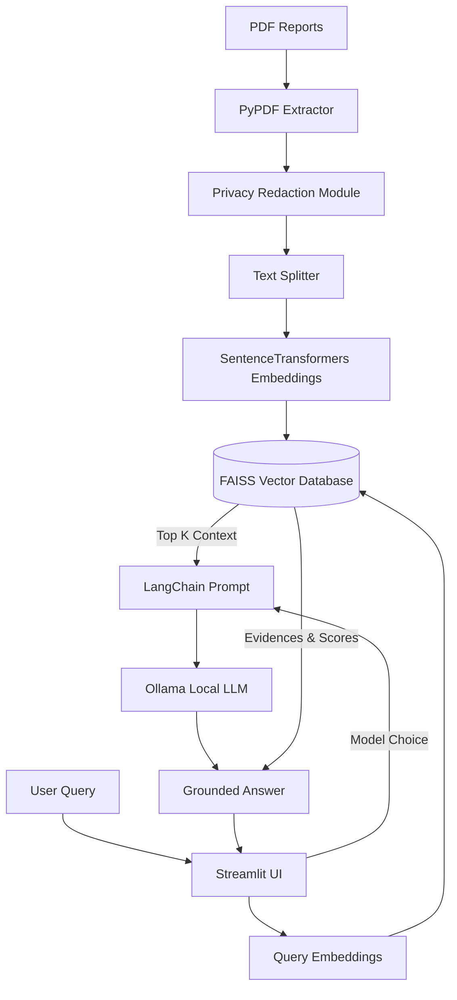

# Multimodel Dengue Report RAG Assistant

A healthcare Retrieval-Augmented Generation (RAG) chatbot designed to answer questions from synthetic dengue patient reports. This system is entirely local and privacy-preserving, running offline using FAISS and Ollama.

## Features
- **PDF Ingestion**: Reads dengue patient reports and extracts text using PyPDF.
- **Privacy First**: Automatically redacts sensitive information (Phones, Emails, PAN, Aadhaar) before processing.
- **Local Embeddings**: Generates document embeddings using `sentence-transformers`.
- **Vector Storage**: Uses FAISS for lightning-fast similarity search.
- **Local LLM via Ollama**: Prompts models like `llama3` or `gemma` to generate strictly grounded answers to prevent hallucinations.
- **Evidence UI**: Shows exactly which chunks of text were used to answer the query, along with similarity scores and source filenames.
- **Streamlit Interface**: Professional, clean UI for chatting and uploading documents.

## Architecture



## Prerequisites

1. Python 3.9+
2. [Ollama](https://ollama.com/) installed and running locally.
3. Necessary models pulled in Ollama:
   ```bash
   ollama run llama3
   ollama run gemma
   ```

## Installation

1. Clone or download this project.
2. Install Python dependencies:
   ```bash
   pip install -r requirements.txt
   ```

## Running the Application

1. Make sure Ollama is running in the background.
2. Start the Streamlit application:
   ```bash
   streamlit run app.py
   ```
3. Upload some Dengue PDF reports via the sidebar and click **Process Documents**.
4. Start asking questions in the chat!

## Sample Screenshots Description

- **Main Chat Interface**: A clean chat view where users can type questions. The assistant replies professionally, and an expandable "🔍 View Retrieved Evidence" dropdown sits beneath the answer.
- **Evidence Expander**: When clicked, it reveals the exact text snippets pulled from the PDFs, including the source filename and the FAISS distance score.
- **Sidebar**: Contains the Model selection dropdown (`llama3` or `gemma`), the PDF upload widget, and a status indicator for the FAISS Vector Database.
